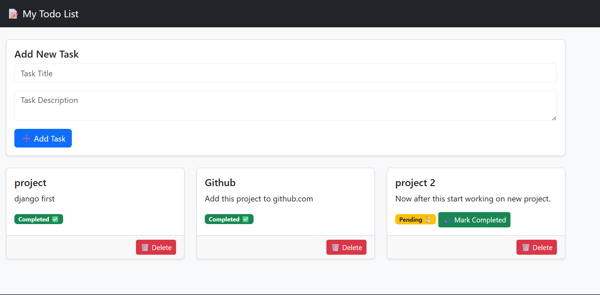

# 📝 Django TODO App

A simple Task Management application built with **Django**.  
Users can add, update, delete, and mark tasks as completed.  

---

## 📸 Screenshot

### Homepage


---

## ✨ Features
- Add, update, and delete tasks
- Mark tasks as completed
- Simple and clean UI
- Built with Django

---

## ⚙️ Installation

### Prerequisites
- Python 3.x
- pip
- virtualenv (recommended)
- Git

### Steps
1. Clone the repository:
```bash
git clone https://github.com/Anchal-Koli/ToDo_App.git
cd django-todo-app

### Create a virtual environment:
python -m venv venv


### Activate the virtual environment:
# Windows:
venv\Scripts\activate

# Mac/Linux:
source venv/bin/activate

### Install dependencies:
pip install -r requirements.txt

### Run migrations:
python manage.py migrate

### Start the development server:
python manage.py runserver

###Open in browser:
http://127.0.0.1:8000/

###🛠️ Technologies
Python 3.x
Django
HTML,Bootstrap
SQLite

📂 Project Structure
todo_project/
│
├── todo_app/              # Main Django app
│   ├── migrations/
│   ├── templates/
│   ├── static/
│   ├── models.py
│   ├── views.py
│   └── urls.py
├── db.sqlite3
├── manage.py
├── requirements.txt
└── README.md

